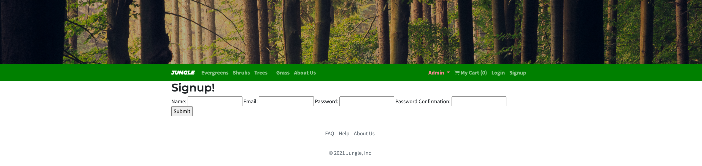
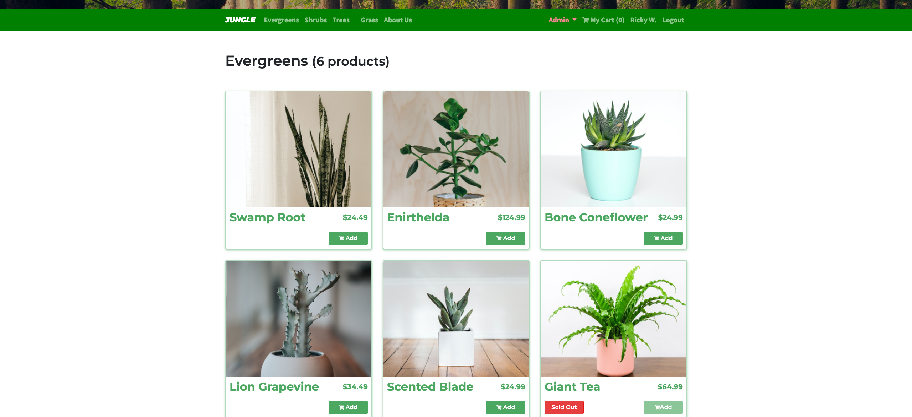
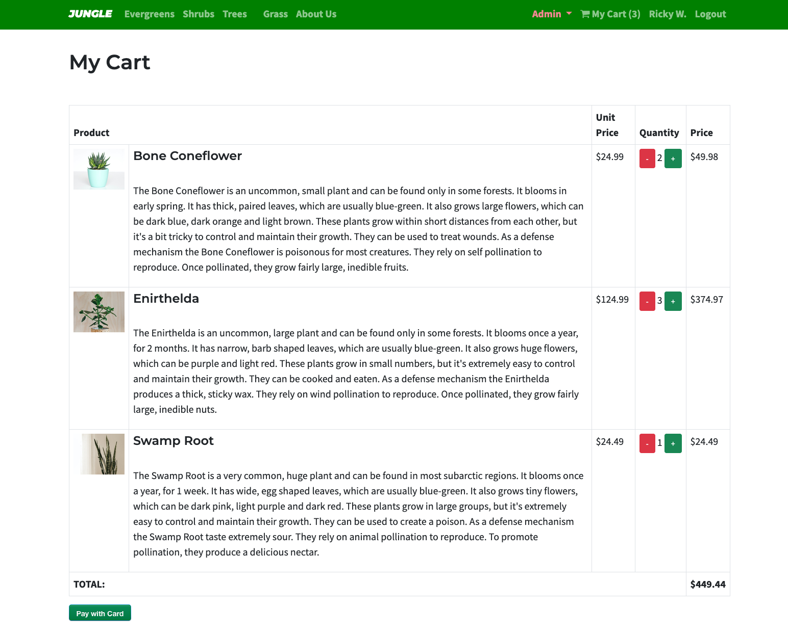

# Jungle

A mini e-commerce application built with Rails 6.1 for purposes of teaching Rails by example.

## Final Product Screenshots

### Jungle - Main Layout
 

### Jungle - Signup
 

### Jungle - Product Page

### Jungle - Cart Page

## Features
- Users sign up and make product purchases
- Admin can add product categories and items

## Testing Methodology
- Rspec to meet component testing
- End-to-end testing with Cypress Testing Framework

## Setup

1. Run `bundle install` to install dependencies
2. Create `config/database.yml` by copying `config/database.example.yml`
3. Create `config/secrets.yml` by copying `config/secrets.example.yml`
4. Run `bin/rails db:reset` to create, load and seed db
5. Create .env file based on .env.example
6. Sign up for a Stripe account
7. Put Stripe (test) keys into appropriate .env vars
8. Run `bin/rails s -b 0.0.0.0` to start the server

## Database

If Rails is complaining about authentication to the database, uncomment the user and password fields from `config/database.yml` in the development and test sections, and replace if necessary the user and password `development` to an existing database user.

## Stripe Testing

Use Credit Card # 4111 1111 1111 1111 for testing success scenarios.

More information in their docs: <https://stripe.com/docs/testing#cards>

## Dependencies

- Rails 6.1 [Rails Guide](http://guides.rubyonrails.org/v6.1/)
- Bootstrap 5
- PostgreSQL 9.x
- Stripe
- gem 'rails', '6.1.5.1'
- gem 'pg'
- gem 'puma', '~> 5.0'
- gem 'sass-rails', '>= 6'
- gem 'webpacker', '~> 5.0'
- gem 'turbolinks', '~> 5'
- gem 'jbuilder', '~> 2.7'
- gem 'jquery-rails'
- gem 'sdoc', group: :doc
- gem 'bcrypt', '~> 3.1.7'
- gem 'bootstrap', '~> 5.0.1'
- gem 'font-awesome-rails'
- gem 'money-rails'
- gem 'stripe'
- gem 'rmagick'
- gem 'faker'
- gem 'carrierwave'
- gem 'pry'
- rails/actioncable": "^6.0.0",
- rails/activestorage": "^6.0.0",
- rails/ujs": "^6.0.0",
- rails/webpacker": "5.4.0",
- "turbolinks": "^5.2.0",
- "webpack": "^4.46.0",
- "webpack-cli": "^3.3.12"